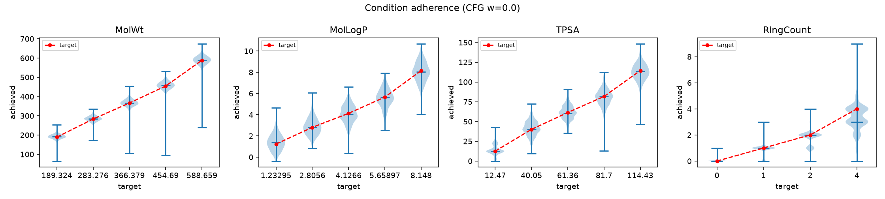

# PI1M Conditional Diffusion

用 [PI1M](https://github.com/RUIMINMA1996/PI1M)（99.6 萬筆高分子重複單元 SMILES）訓練的
**條件式離散擴散模型**：你給定想要的分子性質數值，它生成符合這些數值的新高分子重複單元。

```bash
python src/sample.py --ckpt checkpoints/mdlm_pi1m/best.pt -n 1000 \
    --target MolWt=350 MolLogP=2.5 TPSA=60
```
→ 1639 個 PI1M 中不存在的新高分子，MolWt 中位數 **350.5**（目標 350）、TPSA **61.4**（目標 60）。

---

## 目錄

- [這在解什麼問題](#這在解什麼問題)
- [方法](#方法)
- [安裝](#安裝)
- [執行](#執行)
- [結果](#結果)
- [限制](#限制)
- [程式碼結構](#程式碼結構)

---

## 這在解什麼問題

一般的分子生成模型是「隨機生成看起來合理的分子」。這裡要的是 **inverse design**：
先指定目標性質，再反推出滿足這些性質的結構。

輸入是一組（可以只給一部分的）分子描述子目標值，輸出是高分子重複單元的 SMILES，
兩端用 `*` 標記聚合接點，例如：

```
*C(=O)C=CC=C1CN=NN=C1c1ccc(NCCCc2ccc(*)cc2)cn1
```

## 方法

### 為什麼用 SELFIES，以及 `[Au]` 是怎麼回事

擴散模型在離散的 SMILES 字串上生成，很容易產生語法不合法的字串。
[SELFIES](https://github.com/aspuru-guzik-group/selfies) 是一種**任何 token 序列都能解碼成合法分子**的表示法，
所以生成端不需要額外處理合法性。

但 SELFIES 沒有 wildcard atom，無法直接表示 PI1M 的 `*` 接點。
本專案的做法是編碼前把 `*` 換成 `[Au]`（金原子在 PI1M 中完全不出現，不會撞號），解碼後再換回來：

```
*CCCOC(=O)C*   →  [Au]CCCOC(=O)C[Au]  →  SELFIES tokens  →  ...  →  *CCCOC(=O)C*
```

**注意**：描述子是在**原始 `*` 形式**上計算的，不是 `[Au]` 形式。
`*` 是 dummy atom，質量算 0；如果在 `[Au]` 形式上算，每個接點會多出 197 g/mol，
MolWt 全部偏掉 394。這是這類做法最容易踩的坑。

### 擴散過程：absorbing-state masked diffusion

採用 [MDLM](https://arxiv.org/abs/2406.07524) 的連續時間形式，schedule 為 `α_t = 1 - t`：

- **前向**：時間 `t` 時，每個 token 各自以機率 `t` 被換成 `[MASK]`。`t=1` 時全部是 mask。
- **損失**：`E_t [ (1/t) · Σ_{被遮的位置} CE(x₀, p_θ) ]`，是 NLL 的上界。
  `t` 用 antithetic 低差異取樣以壓低變異數。
- **反向**：從全 mask 開始，每步以機率 `(t-s)/t` 解開部分 mask，
  **已解開的 token 就凍結不再更動**（carry-over unmasking）。

比起在連續 latent 上做擴散，這條路線不需要另外訓練 VAE，是端到端的單階段訓練。

### 條件機制

10 個 RDKit 描述子作為條件：

```
MolWt, MolLogP, TPSA, NumHDonors, NumHAcceptors,
NumRotatableBonds, RingCount, FractionCSP3, QED, SAscore
```

先用 `QuantileTransformer(output_distribution="normal")` 轉成近高斯再 clip 到 ±5，
接著每個描述子各自經過 Fourier 特徵 + MLP，加總後與 timestep embedding 一起
用 **AdaLN-Zero**（DiT 的做法）調變 Transformer 的每一層。

關鍵設計是**每個描述子有自己獨立的 null embedding**，訓練時隨機遮罩：

| 機率 | 遮罩方式 | 為了什麼 |
|------|----------|----------|
| 10% | 全部丟棄 | 支援 classifier-free guidance |
| 30% | 每個特徵各 50% 機率丟棄 | **推論時可以只指定任意子集** |
| 60% | 全部保留 | 主要條件訊號 |

所以你可以只鎖 `MolWt` 和 `logP`，其餘 8 個描述子讓模型自由發揮 —— 這是實務上最常用的情境。

### 模型

DiT-style Transformer，12 層 / d=512 / 8 heads / AdaLN-Zero，**61.2M 參數**。
序列長度 96 tokens，詞彙 182（含 `[PAD]`=0、`[MASK]`=1）。

## 安裝

```bash
conda create -n polymer python=3.11
conda activate polymer
pip install -r requirements.txt
```

模型權重（468MB）與資料未納入版控。資料重建方式：

```bash
mkdir -p data
curl -L -o data/PI1M.csv \
    https://raw.githubusercontent.com/RUIMINMA1996/PI1M/master/PI1M.csv
python src/preprocess.py --max-len 96 --workers 32     # 約 5 分鐘（32 核）
```

前處理會濾掉 RDKit 解析失敗與 SELFIES 超過 96 tokens 的分子，
995,799 → **974,942** 筆（保留 97.9%）。

## 執行

```bash
# 訓練：單張 RTX PRO 6000，40 epoch / 75,400 steps，約 3.2 小時
python src/train.py --data data/pi1m_processed.npz --out checkpoints/mdlm_pi1m \
    --dim 512 --depth 12 --batch-size 512 --epochs 40

# 條件生成（未指定的描述子會用各自的 null embedding，交給模型自由發揮）
python src/sample.py --ckpt checkpoints/mdlm_pi1m/best.pt -n 1000 \
    --target MolWt=350 MolLogP=2.5 TPSA=60 --out outputs/gen.csv

# 條件達成度掃描：每個描述子掃 p10~p90，出 adherence.csv / adherence.png
python src/evaluate.py --ckpt checkpoints/mdlm_pi1m/best.pt

# CFG 強度消融
python src/guidance_sweep.py --ckpt checkpoints/mdlm_pi1m/best.pt
```

`sample.py` 會用 RDKit 重算生成分子的描述子，直接印出 target vs. achieved：

```
[condition adherence]  target   mean    median     MAE     within10%
  MolWt                 350.000  348.881  350.484   15.802     91.8%
  MolLogP                 2.500    2.664    2.676    0.672     23.9%
  TPSA                   60.000   61.375   61.440    7.743     47.7%
```

其他常用參數：`--guidance`（CFG 強度，預設 0，見下方）、`--steps`（去噪步數，預設 128）、
`--jitter`（在標準化空間對條件加噪以換取多樣性）、`--temperature` / `--top-p`。

## 結果

### 指標定義

| 指標 | 定義 |
|---|---|
| `validity` | RDKit 可解析 |
| `polymer_valid` | 可解析**且**恰好 2 個 `*` 接點（真正可用的重複單元） |
| `uniqueness` | 去重後比例 |
| `novelty` | 不在 PI1M 訓練集中的比例 |

`polymer_valid` 是這個任務真正該看的指標：SELFIES 保證分子合法，但不保證接點數正確。

### 訓練曲線

40 epoch / 75,400 steps，best val loss **0.1560**（step 72,000）。完整紀錄見 `checkpoints/mdlm_pi1m/log.csv`。

| step | val loss | validity | polymer_valid | novelty |
|---|---|---|---|---|
| 4,000 | 0.424 | 0.943 | 0.135 | 1.000 |
| 8,000 | 0.292 | 0.988 | 0.645 | 0.991 |
| 20,000 | 0.214 | 0.988 | 0.834 | 0.967 |
| 40,000 | 0.181 | 0.984 | 0.861 | 0.955 |
| 56,000 | 0.162 | 0.994 | 0.887 | 0.938 |
| 72,000 | **0.156** | 0.990 | 0.838 | 0.949 |

`polymer_valid` 在 step 8,000 前後從 0.13 快速跳到 0.65 —— 模型是在這個階段學會「要放兩個接點」的。
step 56,000 之後 val loss 就平了，40 epoch 是夠的。

### 條件達成度

每個 target 生成 512 個樣本（`outputs/eval_g0/`）：

| 描述子 | Spearman(target, achieved) | MAE 範圍 (p10→p90) |
|---|---|---|
| MolWt | **0.970** | 10.4 → 19.2（相對誤差 2–5%） |
| TPSA | **0.960** | 4.6 → 9.1 |
| MolLogP | **0.931** | 0.64 → 0.79 |
| RingCount | **0.902** | 0.02 → 0.87 |



藍色小提琴是生成分子的實際分佈，紅線是目標值。各百分位的中位數幾乎落在目標線上。

三個描述子同時指定（`MolWt=350, logP=2.5, TPSA=60`，2000 樣本，`outputs/gen_final.csv`）：

| 描述子 | target | median | MAE | ±10% 命中 |
|---|---|---|---|---|
| MolWt | 350 | 350.5 | 15.8 | 91.8% |
| MolLogP | 2.5 | 2.68 | 0.67 | 23.9% |
| TPSA | 60 | 61.4 | 7.7 | 47.7% |

`validity 0.993 / polymer_valid 0.820 / uniqueness 1.000 / novelty 0.998`
—— 1639 個去重後的新高分子，只有 0.2% 撞到 PI1M。

> logP 的 ±10% 命中率偏低是因為 10% 只有 ±0.25，這個容忍度對 logP 過嚴；
> MAE 0.67 才是合理的讀數。

### CFG 在這個模型上幫倒忙

一般擴散模型靠 classifier-free guidance 加強條件遵循，但這裡不是（`outputs/guidance_sweep.csv`，
3 個描述子同時指定，512 樣本）：

| guidance | polymer_valid | MolWt MAE | logP MAE | TPSA MAE |
|---|---|---|---|---|
| **0** | **0.832** | 15.4 | 0.67 | 7.79 |
| 1 | 0.777 | 13.7 | 0.66 | 7.83 |
| 2 | 0.703 | 14.6 | 0.69 | 7.70 |
| 3 | 0.615 | 20.2 | 0.72 | 8.74 |
| 5 | 0.426 | 28.9 | 0.93 | 10.11 |

原因是條件訊號本身已經夠強（訓練時 60% 完全條件化），CFG 只是放大 logits，
反而破壞「恰好 2 個接點」這個**全域**約束 —— 而 masked diffusion 每個位置是獨立解遮的，
本來就不擅長維持全域計數約束。w=5 時有效率掉到 0.43，MAE 還變差。

**所以預設是 `--guidance 0`。** 只鎖單一描述子時 w≈2 可以再壓低一點 MAE
（MolWt MAE 10.4→7.5）而 polymer_valid 只掉 1.5pt，見 `outputs/eval_g2/`。

## 限制

1. **條件是重複單元的分子描述子，不是真正的高分子性質。**
   Tg、介電常數、模數這些都不在裡面 —— PI1M 只有 SMILES，沒有性質標註。
   要做性質導向的材料設計，需要用有標註的資料集（PolyInfo / Khazana）微調條件分支，
   或再接一個 property predictor。

2. **約 15% 的樣本接點數不是 2**（多半是只有 1 個）。
   生成成本很低，實務上直接過濾即可，`sample.py` 已內建。

3. **描述子彼此不獨立。** 同時指定物理上互斥的組合（例如高 MolWt 配極低 RotatableBonds）
   時模型只能折衷，這種情況下 MAE 會明顯變差。

4. **`polymer_valid` 停在 0.85–0.89。** 除了接點數，另一個成因是 SELFIES 解碼偶爾會
   吃掉尾端 token。要再往上推，可以考慮在取樣時加入接點數的約束解碼。

## 程式碼結構

| 檔案 | 說明 |
|------|------|
| `src/preprocess.py` | SMILES → SELFIES tokens + RDKit 描述子，多進程 |
| `src/dataset.py` | 資料集、QuantileTransformer、條件 dropout |
| `src/model.py` | DiT denoiser + per-feature condition embedder |
| `src/diffusion.py` | masked diffusion 的前向、損失、取樣器 |
| `src/train.py` | 訓練迴圈（EMA、cosine LR、定期抽樣評估） |
| `src/sample.py` | 條件生成 CLI + 達成度報告 |
| `src/evaluate.py` | 條件掃描 + 圖 |
| `src/guidance_sweep.py` | CFG 強度消融 |
| `src/utils.py` | token→SMILES 轉換、生成指標 |

`checkpoints/mdlm_pi1m/scaler.pkl` 是推論必需的（描述子的 QuantileTransformer），已納入版控；
`.pt` 權重檔沒有。

## 參考

- PI1M 資料集 — Ma & Luo, *J. Chem. Inf. Model.* 2020
- MDLM — Sahoo et al., [Simple and Effective Masked Diffusion Language Models](https://arxiv.org/abs/2406.07524), NeurIPS 2024
- SELFIES — Krenn et al., *Mach. Learn.: Sci. Technol.* 2020
- DiT / AdaLN-Zero — Peebles & Xie, [Scalable Diffusion Models with Transformers](https://arxiv.org/abs/2212.09748), ICCV 2023
